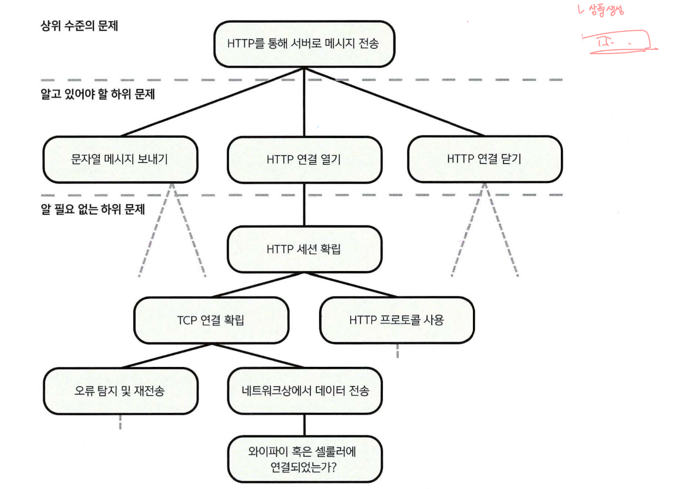

# 2. 추상화 계층
- 깔끔한 추상화 계층을 통해 문제를 하위 문제로 세분화 하는 방법
- 추상화 계층이 코드 품질의 요소를 달성하는 데 어떻게 도움이 되는지
- API 및 구현 세부 사항
- 함수, 클래스 및 인터페이스를 사용해 코드를 추상화 계층으로 나누는 방법

### 2.1 널값 및 의사코드 규약
Java - 옵셔널
변수, 함수의 매개변수 및 반환 유형은 모두 널값을 가질 수 없다.
? 기호가 붙어 있으면 널값을 가질 수 있다는 의미

### 2.2 왜 추상화 계층을 만드는가?
코드 작성은 복잡한 문제를 계속해서 더 작은 하위 문제로 세분화 하는 작업

메시지 문자열 보내기: connection.send("Hello server");
- 하위 문제
  - 전송할 수 있는 형식으로 문자열 직렬화
  - HTTP 프로토콜의 모든 복잡한 동작
  - TCP 연결
  - 사용자의 장치가 와이파이 혹은 셀룰러 네트워크에 연결되어 있는지 여부 확인
  - 데이터를 라디오 신호로 변조
  - 데이터 전송 및 오류 수정

[그림 2.1] 간결한 추상화 계층은 상위 수준의 문제를 해결하기 위해 몇 가지 개념만 알면 된다는 것을 의미한다. (어려운 문제 고민할 떄 이 그림처럼 하면 좋을듯 - 윤서)

하위 문제들을 식별하고 올바른 추상화 계층을 만듦으로써 그 복잡한 문제를 쉽게 다룰 수 있다.

#### 2.2.1 추상화 계층 및 코드 품질의 핵심 요소
가독성 - 꺠끗하고 뚜렷한 추상화 계층을 만드는 것은 개발자가 한 번에 한두 개 계층과 몇 개의 개념만 다루면 되는 것을 의미한다.
모듈화 - 추상화 계층이 하위 문제에 대한 해결책을 깔끔하게 나누고 구현 세부 사항이 외부로 노출되지 않도록 보장할 때, 다른 계층이나 코드의 일부에 영향을 미치지 않고 계층 내에서만 구현을 변경하기가 매우 쉬워진다.
재사용성 및 일반화성 - 해당 하위 문제에 대한 해결책을 재사용하기가 쉬워진다. 
테스트 용이성 - 코드가 추상화 계층으로 꺠끗하게 분할되면 각 하위 문제에 대한 해결책을 완벽하게 테스트하는 것이 훨씬 쉬워진다.

### 2.3 코드의 계층
추상화 계층을 생성하는 방법은 코드를 서로 다른 단위로 분할하여 단위 간의 의존 관계를 보여주는 의존성 그래프를 생성하는 것
- 함수
- 클래스(및 구조체나 믹스인과 같이 클래스와 비슷한 요소도 가능)
- 인터페이스(또는 이와 동일한 요소)
- 패키지, 네임스페이스, 모듈

#### 2.3.1 API 및 구현 세부 사항
- 코드를 호출할 때 볼 수 있는 내용:
  - 퍼블릭 클래스, 인터페이스 및 함수(메서드)
  - 이름, 입력 매개변수 및 반환 유형이 표현하고자 하는 개념
  - 코드 호출시 코드를 올바르게 사용하기 위해 알아야 하는 추가 정보(예: 호출순서)

- 코드를 호출할 때 볼 수 없는 애용: 구현 세부 사항 

API는 호출하는 쪽에 공개할 개념만 정의하면 되고 그 이외의 모든 것은 구현 세부사항

#### 2.3.2 함수
각 함수에 포함된 코드가 하나의 잘 써진 짧은 문장처럼 읽히면 이상적이다.

이해하기 쉽고 단순한 문장으로 표횬되는 함수를 작성하기 위한 좋은 전략 2가지
- 단일 업무 수행
- 잘 명명된 다른 함수를 호출해서 더 복잡한 동작 구성

일단 함수를 작성했으면 작성된 코드를 문장으로 만들어보면 좋다.(리뷰 기준 - 소린)

#### 2.3.3 클래스

줄수

응집력 - 한 클래스 내의 모든 요소들이 얼마나 잘 속해 있는지를 보여주는 척도
- 순차적 응집력: 한 요소의 출력이 다른 요소에 대한 입력으로 필요할 때 발생
- 기능적 응집력: 몇 가지 요소들이 모여서 하나의 일을 성취하는데 기여할 때 발생

관심사의 분리 - 각각 별개의 문제(또는 관심사)를 다루는 개별 구성 요소로 분리되어야 한다고 주장하는게 설계 원칙

응집력과 관심사의 분리에 대해 생각할 때는 서로 관련된 여러 가지 사항을 하나의 사항으로 간주하는 것을 어느 수준에서 해야 유용할지 결정해야 한다.
이것은 매우 주관적일 수 있기 때문에 종종 보기보다 까다로울 수 있다.

- 코드 가독성
- 코드 모듈화
- 코드 재사용성 및 일반화
- 테스트 용이성 및 적절한 테스트
이 클래스가 분리되어야 할지 판단하기 위해서는 이 클래스가 어떻게 네 가지 핵심 요소에 반하여 작성되어 있는지 살펴보는 것이 더 나을 수 있다.

코드를 적절한 크기의 클래스로 쪼개지 않으면 너무 많은 개념을 한꺼번에 다루고, 가독성이 떨어지며 모듈화가 덜 이루어지고, 재사용과 일반화가 어렵고, 테스트하기도 어려워진다.

하위 문제에 대한 해결책을 자체 클래스로 분할하여 생성자의 매개변수를 통해 의존성 주입하면 개선할 수 있다.

클래스 구조를 설계할 때 코드 품질의 네 가지 핵심 요소를 충족하는지 신중하게 생각하면 좋다.

#### 2.3.4 인터페이스
하나의 추상화 계층에 대해 두 가지 이상의 다른 방식으로 구현하거나 향후 다르게 구현할 것으로 예상되는 경우 인터페이스를 정의하는 것이 좋다.

장점
- 퍼블릭 API를 매우 명확하게 보여준다.
- 한 가지 구현만 필요하다고 잘못 추측한 것일 수 있다.
- 테스트를 쉽게 할 수 있다.
- 같은 클래스로 두 가지 하위 문제를 해결할 수 있다.

단점
- 더 많은 작업이 필요하다.
- 코드가 복잡해질 수 있다.

인터페이스를 사용할 경우 그 장점이 확실한 상황에서는 인터페이스를 사용하되, 인터페이스만을 위한 인터페이스를 작성해서는 안된다.

#### 2.3.5 층이 너무 얇아질 때
분할을 위한 분할은 의미가 없다는 것을 명심해야 한다. 비용이 이익보다 더 큰 시점이 올 수 있으므로 상식에 맞게 적용하는 것이 좋다.

어떤 것이 더 나을지 확실하지 않다면, 너무 많은 계층을 남용하는 결과를 가져오더라도 계층을 여러 개로 나누는 것이 한 계층 안에 모든 코드를 집어넣는 것보다는 낫다.
최선의 조언은 자신이 만든 계층이 코드의 가독성을 높이고, 재사용할 수 있고, 일반화할 수 있으며, 모듈화되고, 테스트를 용이하게 하는지를 스스로 판단하고 신중하게 생각해보는 것이다.

### 2.4 마이크로 서비스는 어떤가?
마이크로 서비스 자체가 간결한 추상화 계층을 제공한다.
시스템을 분리하여 보다 모듈화할 수 있는 매우 좋은 방법이지만, 서비스를 구현하기 위해 여러 하위 문제를 해결해야 한다는 사실은 바뀌지 않는다. 올바른 추상화 및 코드 게층을 만드는 것은 여전히 중요하다.
