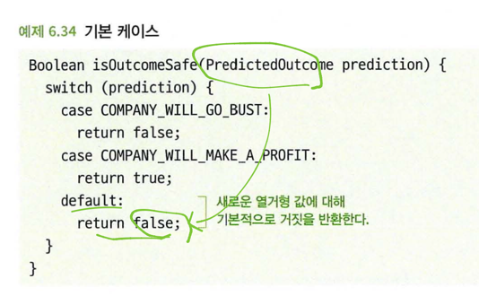
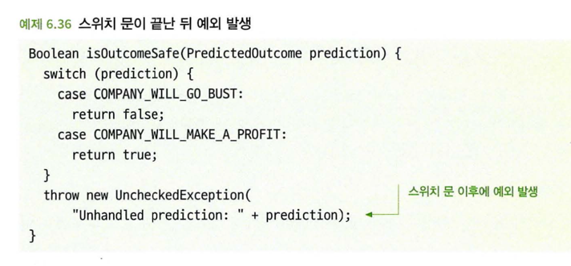

## 6.6 미래를 대비한 열거형 처리
 - 우리가 의존하는 코드에 대해 부실한 가정을 할 경우에도 우리의 예상을 벗어나는 결과를 초래할 수 있다.
 - 열거형에 대해서 개발자들 사이에 논쟁이 있다. 일부에서는 형 안전성을 제공하고 함수나 시스템에 유효하지 않은 입력을 방지할 수 있는 훌륭하고 간단한 방법이라고 주장한다.
 - 다른 사람들은 열거형의 특정 값을 처리하기 위한 논리가 코드 전반에 퍼져 있게되기 때문에 간결한 추상화 계층을 막는다고 주장한다.
 - 후자에 속한 개발자들은 종종 다형성이 더 나은 방식이라고 주장한다.
 - 어떤 값이 특정 클래스에서만 사용된다면 그 클래스 내에 해당 값에 대한 정보와 동작을 캡슐화한 다음, 이 클래스들이 공통 인터페이스를 구현하도록 하자는 것이 이 주장의 요지다.

 - **열거형을 처리해야하는 경우 나중에 열거형에 더 많은 값이 추가될 수 있다는 점을 기억**하자.

### 6.6.1 미래에 추가될 수 있는 열거값을 암묵적으로 처리하는 것은 문제가 될 수 있다. 
 - 예로 열거형 A, B, C에 대해 A, B, C에 대한 조건문으로만 로직을 분리하면 D라는 새로운 열거값이 생겼을 때 로직이 올바르게 처리되지 않을 수 있다.

### 6.6.2 해결책: 모든 경우를 처리하는 스위치 문을 사용하라
 - 열거형의 일부값을 명시적이 아닌 암시적인 방식으로 처리하면 문제가 있다.
 - 더 나은 접근법은 모든 열거값을 며시적으로 처리하고, 처리되지 않은 새로운 열거값이 추가되는 경우 코드 컴파일이 실패하거나 테스트가 실패하게 하는 것이다.

```java
enum PredicatedOutcome {
    A,
    B
}

Boolean isOutcomeSafe(PredicatedOutcome prediction) {
    switch (prediction) {
        case A:
            return false;
        case B:
            return true;
    }
    throw new UncheckedException(); // 처리되지 못한 열거형 값이 있다면 프로그래밍 오류이기 떄문에 비검사 예외를 발생한다.
}
```

 - 임의의 값에 대해 예외가 발생하면 테스트가 실패하고 PredictedOutcome에 새 값을 추가한 개발자는 isOutcomeSafe() 함수도 변경해야 함을 알게 된다.

```java
testIsOutcomeSafe_allPredictedOutcomeValues() {
    for (PredictedOutcome prediction in PredictedOutcome.values()) { // 열거형의 모든 값에 대해 반복한다. 
        isOutcomeSafe(prediction); // 처리되지 않은 값으로 인해 예외가 발생하면 테스트는 실패한다. 
    }
}
```

 - 단위 테스트와 함께 모든 값을 다 처리하는 스위치 문을 사용함으로써 코드가 예측을 벗어나 동작하거나 잠재적으로 치명적인 버그가 발생하지 않도록 방지할 수 있다.

### 6.6.3 기본 케이스를 주의하라
 - 열거형을 처리하는 스위치 문에 기본 케이스를 추가하면 향후 열거형 값이 암시적으로 처리될 수 있으며 잠재적으로 예기치 않은 문제와 버그가 발생할 수 있다. 



 - **기본 케이스에 예외 발생**
   - 기본 케이스를 사용하는 또 다른 방법은 열거값이 처리되지 않았음을 나타내는 예외를 발생하는 것이다.
   - 일부 언어에서는 미묘한 방식으로 오류 발생을 더 쉽게 만들 수 있다.
   - 스위치 문에 기본 케이스를 추가하면 컴파일러는 나중에 해당 열거형에 새 값이 추가되더라도 스위치 문이 모든 값을 처리한다고 판단한다.
   - 즉, 컴파일러는 경고를 출력하지 않기 때문에 컴파일러가 제공하는 추가적인 보호를 받을 수 없다.
   - 컴파일러가 처리되지 않은 열거값에 대한 경고를 여전히 출력하도록 하려면 스위치 문이 끝나고 `throw new UncheckedException()` 문을 그대로 두는 것이 낫다.



### 6.6.4 주의 사항: 다른 프로젝트의 열거형에 의존
 - 떄로는 자신이 작성한 코드가 다른 프로젝트나 조직이 개발한 코드의 열거형에 의존할 수 있다.
 - 그 열거형을 어떻게 처리해야하는가는 자신이 속한 팀이나 조직의 개발 및 출시 주기뿐만 아니라 그프로젝트와의 관계에 따라 달라진다.
 - 그 프로젝트에서 미리 알려주지 않고 새로운 열거값을 추가할 가능성이 있고 이로 인해 코드가 작동하지 않을 수 있다면, 새로운 값을 다루는 데 있어 허용의 범위가 좀 더 넓어질 수 밖에 없다.

## 6.7 이 모든 것을 테스트로 해결할 수는 없는가?
- 필자의 경험으로 볼 때 이것은 현실에서는 별로 효과가 없는 다소 이상적인 주장이다.
- 예상을 벗어나는 코드를 피하는 것은 여러분이 작성한 코드에 대한 기술적 정확성 때문만은 아니다.
- 다른 개발자가 여러분의 코드를 사용해 코드 작성을 할 때 역시 그 코드가 올바르게 작동하도록 하기 위한 작업이다.
- 다음 이유들로 테스트만으로는 이것을 보증하기에 충분하지 않을 수 있다.
  - 어떤 개발자들은 테스트에 대해 그다지 부지런하지 않을 수도 있다.
  - 목 객체를 통해 테스트해야할 수 있다.
  - 어떤 것들은 테스트하기가 매우 어렵다.
- 테스트는 중요하다. 아무리 많은 코드 구조화나 코드 계약에 대한 걱정도 고품질의 철저한 테스트를 대체할 수 없다.
  - 그러나 필자의 경험상 그 반대 역시 사실이다.
  - 직관적이지 않거나 예상을 벗어나는 코드에 숨어있는 오류를 테스트만으로는 방지하기 어렵다.

# 요약
 - 다른 개발자가 작성하는 코드는 종종 우리가 작성하는 코드에 의존한다.
   - 다른 개발자가 우리 코드의 기능을 잘못 해석하거나 처리해야하는 특수한 경우를 발견하지 못하면, 우리가 작성한 코드에 기반한 그 코드에서 버그가 발생할 가능성이 크다.
   - 코드를 호출하는 쪽에서 예상한대로 동작하기 위한 좋은 방법 중 하나는 중요한 세부 사항이 코드 계약의 명백한 부분에 포함되도록 하는 것이다.
 - 우리가 사용하는 코드에 대해 허술하게 가정을 하면 예상을 벗어나는 또 다른 결과를 볼 수 있다.
 - 테스트만으로는 예측을 벗어나는 코드의 문제를 해결할 수 없다.
   - 다른 개발자가 코드를 잘못 해석하면 테스트해야할 시나리오도 잘못 이해할 수 있다. 

