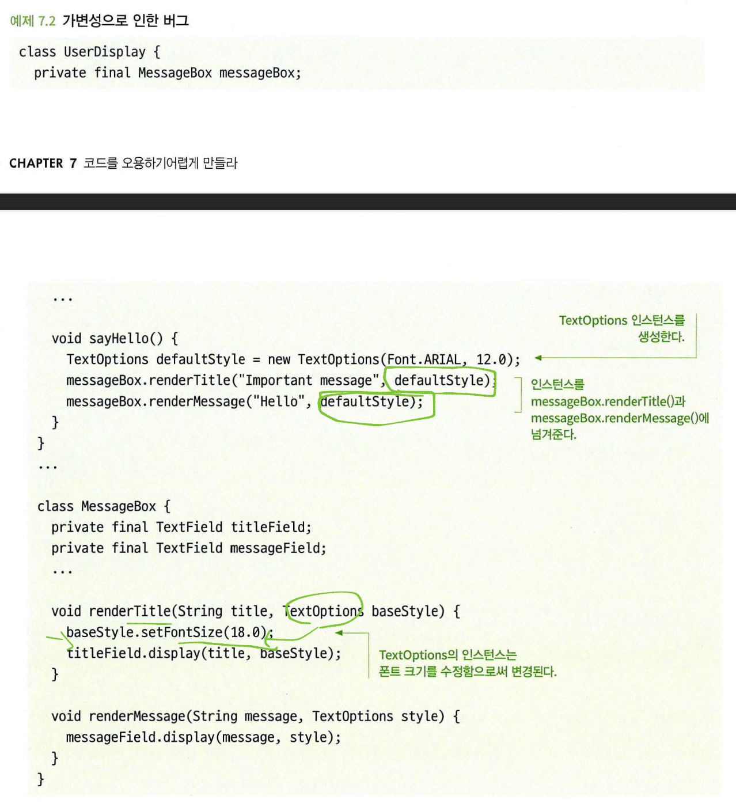
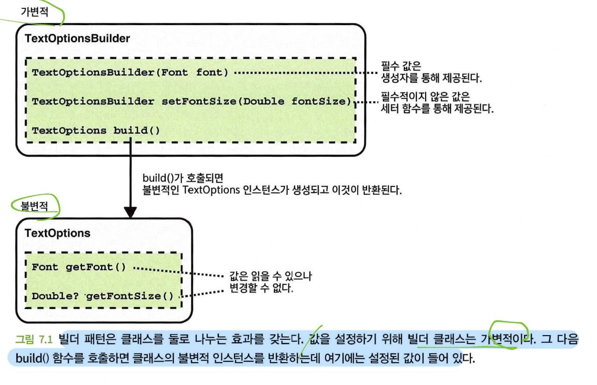
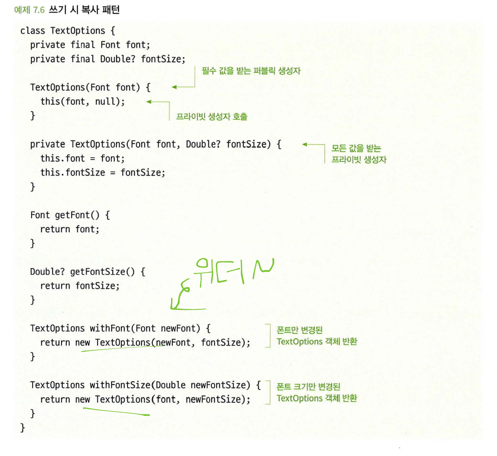
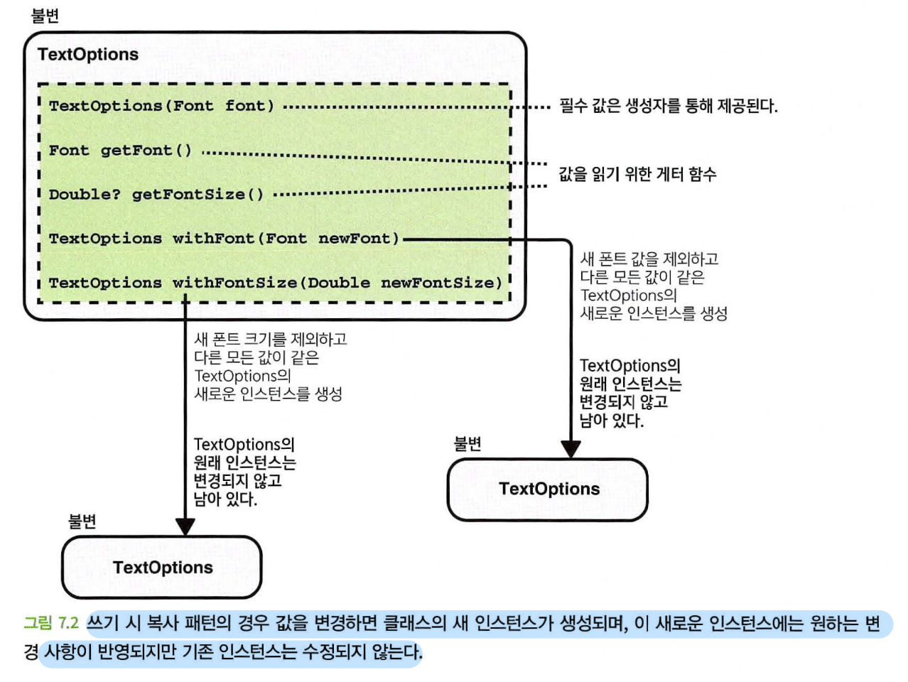
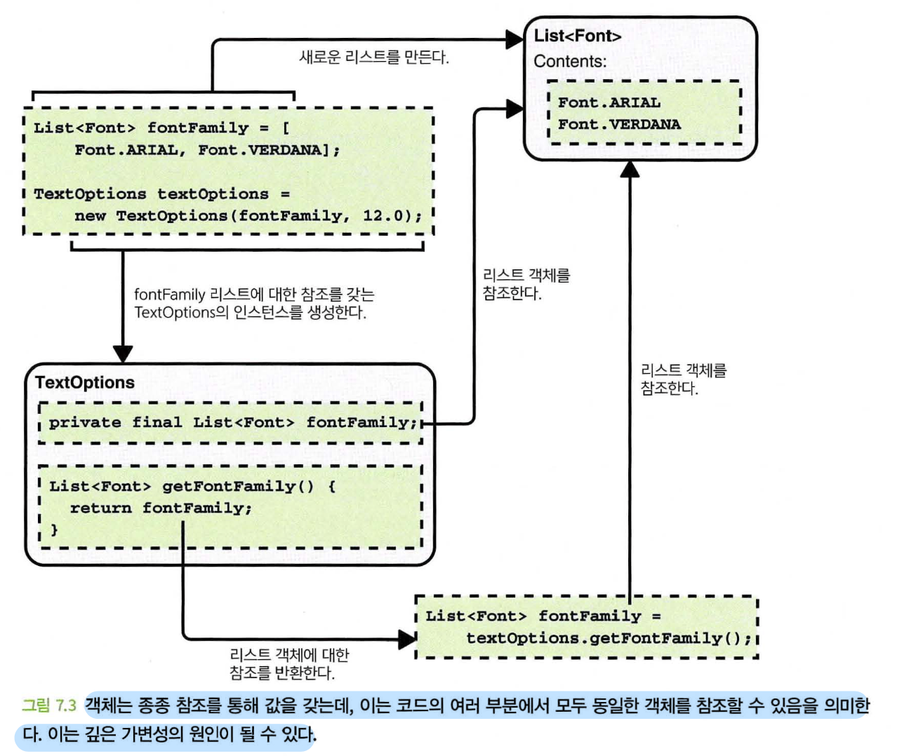
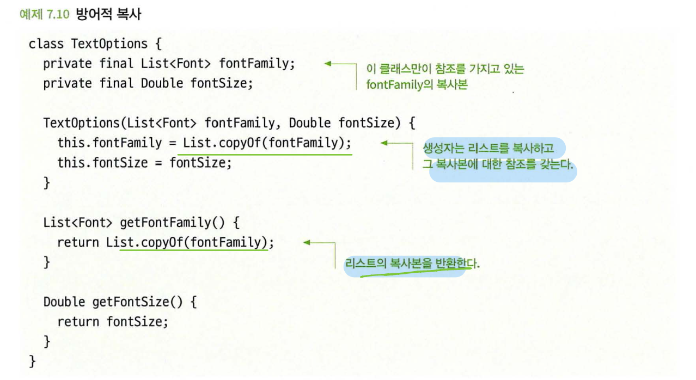
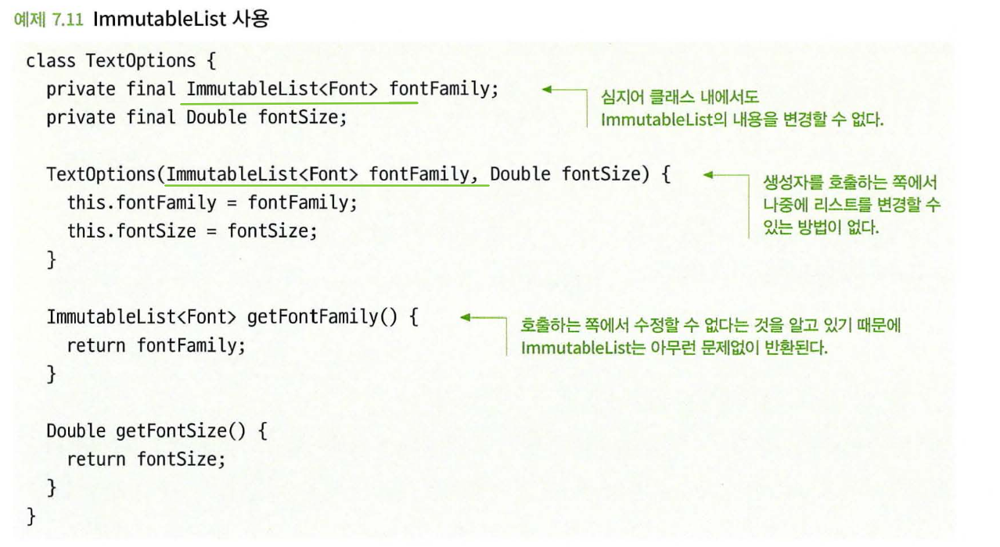
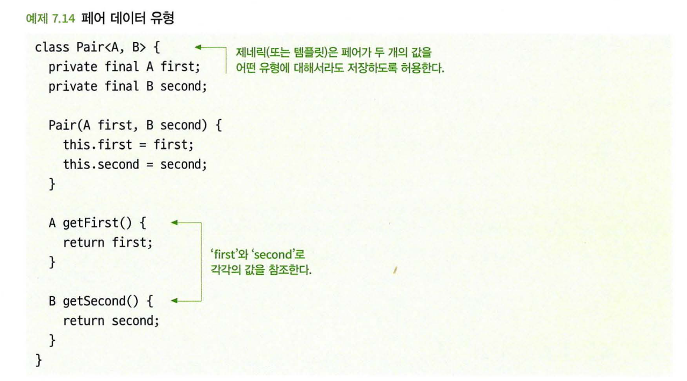

# 코드를 오용하기 어렵게 만들라
이번 장에서 다루는 내용
- 코드 오남용으로 인해 버그가 발생하는 방식
- 코드를 오용하기 쉬운 흔한 방식
- 코드를 오용하기 어렵게 만드는 기술

비합리적이거나 애매한 가정에 기반해서 코드가 작성되거나 다른 개발자가 잘못된 일을 하는 것을 막지 못할 때 코드는 오용되기 쉽다.
- 호출하는 쪽에서 잘못된 입력을 제공
- 다른 코드의 부수 효과(입력 매개변수 수정 등)
- 정확한 시간이나 순서에 따라 함수를 호출하지 않음
- 관련 코드에서 가정과 맞지 않게 수정이 이루어짐

> 오용하기 어려움
>
> 포카 요케(poka yoke)의 린(lean) 제조 개념이다.
> 
> 소프트웨어 엔지니어링 분야에서 이 원칙은 API와 인터페이스가 '사용하기는 쉽고 오용하기는 어려워야 한다'는 문장으로 이해되기도 하는데, EUHM(easy to use and hard to misuse)이라고도 한다.

## 7.1 불변 객체로 만드는 것을 고려하라
객체가 생성된 후에 상태를 바꿀 수 없다면 이 객체는 ```불변(불가변)(immutable)``` 이다.
그 반대인 ```가변(mutability)``` 객체가 어떻게 문제를 일으킬 수 있는지 고려해야 한다.

- 가변 객체는 추론하기 어렵다
- 가변 객체는 다중 스레드에서 문제가 발생할 수 있다.

객체를 불변으로 만드는 것이 항상 가능하지도 않고, 또 항상 적절한 것도 아니다.
필연적으로 상태 변화를 추적해야 하는 경우가 있고 이때는 가변적인 자료구조가 필요하다.
하지만 방금 설명했듯이 가변적인 객체는 코드의 복잡성을 늘리고 문제를 일으킬 수 있기 때문에, 기본적으로는 불변 객체를 만들되 필요한 곳에서 가변적이 되도록 하는 것이 바람직하다.

### 7.1.1 가변 클래스는 오용하기 쉽다


### 7.1.2 해결책: 객체를 생성할 때만 값을 할당하라
모든 값이 객체의 생성 시에 제공되고 그 이후로는 변경할 수 없도록 함으로써 클래스를 불변적으로 만들 수 있고 오용도 방지할 수 있다.

클래스 내에서 변수를 정의할 때 심지어 클래스 내에서도 변수의 값이 변경되지 않도록 할 수 있다.
언어에 따라 다르지만 공통적으로 사용하는 키워드는 ```const``` ```final``` ```readonly``` 이다.
이렇게 하면 해당 변수를 변경하는 코드를 실수로라도 추가하는 것을 방지하고, 그 변수들은 절대 변경되지 않을 것이고 변경되어서도 안 된다는 점을 분명하게 한다.

### 7.1.3 해결책: 불변성에 대한 디자인 패턴을 사용하라
일부 값이 반드시 필요하지 않거나 불변적인 클래스의 가변적 버전을 만들어야 하는 경우, 클래스 보다 다용도로 구현해야 할 필요가 있다.
- 빌더 패턴
- 쓰기 시 복사 패턴

**빌더 패턴**
클래스를 구성할 수 있는 일부 값이 선택 사항인 경우 생성자를 통해 해당 값을 모두 설정하는 것은 상당히 까다로울 수 있다.
이 경우에 세터 함수를 추가하여 클래스를 변경할 수 있도록 만드는 것보다는 빌더 패턴을 사용하는 것이 낫다.
- 값을 하나씩 설정할 수 있는 빌더 클래스
- 빌더에 의해 작성된 불변적인 읽기 전용 클래스

필수 멤버인 값을 설정 함수가 아닌 생성자의 입력 매개변수를 통해 받는다면 잘못된 객체를 생성하는 코드를 작성할 수 없다.


> 빌더 패턴 구현
> 
> - 더 나은 네임스페이스를 위한 내부 클래스 사용
> - toBuilder() 함수를 통해 클래스에서 미리 채워진 빌더를 만들 수 있도록 클래스와 클래스 빌더 사이에 순환 의존성 생성
> - 클래스 생성자를 비공개로 만들어 호출하는 쪽에서 빌더를 사용할 수밖에 없도록 함
> - 빌더의 인스턴스를 생성자의 인수로 사용하여 반복적으로 사용되는 코드 감소

**쓰기 시 복사 패턴**




클래스를 변경할 수 없게 하는 것은 클래스가 오용될 가능성을 최소화하는 좋은 방법이다.
이것은 세터 함수를 제거하고 인스턴스를 생성할 때에만 값을 제공하면 간단하게 할 수 있다.
다른 상황에서는 그에 맞는 적절한 설계 패턴을 사용해야 할 수도 있다.

## 7.2 객체를 깊은 수준까지 볼변적으로 만드는 것을 고려하라
클래스가 실수로 가변적으로 될 수 있는 일반적인 경우는 ```깊은 가변성(deep mutability)``` 때문이다.
이 문제는 멤버 변수 자체가 가변적인 유형이고 다른 코드가 멤버 변수에 액세스할 수 있는 경우에 발생할 수 있다.

### 7.2.1 깊은 가변성은 오용을 초래할 수 있다.
리스트와 같은 클래스는 ```참조(reference)``` 를 가지고 있다는 점을 기억해야 한다.
다른 코드에 해당 리스트에 대한 참조를 가지고 있다면, 리스트를 참조하기 때문에 해당 리스트를 멤버 변수로 갖는 클래스에 영향을 미친다.



### 7.2.2 해결책: 방어적으로 복사하라
클래스가 참조하는 객체가 클래스 외부의 코드에서는 참조할 수 없도록 하면 이 문제를 방지할 수 있다.

이것은 클래스가 생성될 때 그리고 게터(getter) 함수를 통해 객체가 변환될 때 객체의 복사본을 만들면 가능해진다.
깊은 불변성을 담보하기 위해 효과가 있는 간단한 방법이다.



방어적으로 복사하면 불변적인 클래스를 만드는 데 꽤 효과적일 수 있지만, 다음과 같이 단점도 명확하다.
- 복사하는 데 비용이 많이 들 수 있다.(원소의 수가 많을 때)
- 클래스 내부에서 발생하는 변경을 막아주지 못하는 경우가 많다. 단순히 복사하는 것만으로는 깊은 불변성을 완전히 보장할 수 없다.

### 7.2.3 해결책: 불변적 자료구조를 사용하라
객체를 불변적으로 만드는 것은 널리 받아들여지고 있는 좋은 관행이다.
장점은 일단 그것들이 생성되고 나면 아무도 내용을 변경할 수 없다는 것이다.
이것은 방어적으로 복사본을 만들 필요 없이 객체를 전달할 수 있다는 것을 의미한다.



불변적인 자료구조를 사용하는 것은 클래스가 깊은 불변성을 갖도록 보장하기 위한 좋은 방법 중 하나다.
방어적으로 복사해야 하는 단점을 피하고 실수로라도 클래스 내의 코드에서 변경되지 않도록 보장한다.

## 7.3 지나치게 일반적인 데이터 유형을 피하라
일반적이고 다재다능하다는 것을 뒤집어 생각해보면 데이터 유형 자체만으로는 무언가를 설명할 수 없고, 가질 수 있는 값에 있어서도 꽤 관대하다는 것을 의미한다.

정수나 리스트와 같은 유형으로 표현이 '가능'하다고 해서 그것이 반드시 '좋은' 방법은 아니다.
설명이 부족하고 허용하는 범위가 넓을수록 코드 오용은 쉬워진다.

### 7.3.1 지나치게 일반적인 유형은 오용될 수 있다.
- List<List<Double>> 유형 자체로는 아무것도 설명해주지 않는다. 이 리스트가 무엇인지, 어떻게 이해해야 하는지 알지 못할 것이다.
- 사용 순서가 개발자들마다 다르다면 버그가 발생할 것이다.
- 형식 안전성이 거의 없다.

다른 개발자가 어떤 작업을 수행하는 데 있어 세부 조항을 의지하는 것은 신뢰할 만한 방법이 아닌 경우가 많기 때문에 어느 시점에 잘못 사용될 수 있고, 이로 인해 버그가 발생할 가능성이 크다.

**패러다임은 퍼지기 쉽다**
임시변통으로 작성된 코드는 다른 코드 전반에 퍼지는 경향이 있다.
다른 개발자들도 같은 방식으로 하지 않고는 이미 작성된 코드와 상호작용하기 어려워지기 때문이다.
이런 일은 상당히 빨리 그리고 광범위하게 확산될 수 있다.

### 7.3.2 페어 유형은 오용하기 쉽다


페어는 정확히 두 개의 값을 포함해야 하므로 호출하는 쪽에서 실수로 너무 적거나 많은 값을 제공하는 것을 방지한다.
그러나 다른 문제는 여전히 해결되지 않는다.
- List<Pair<Double, Double>>가 무슨 의미인지 여전히 이해하기 어렵다.
- 순서에 대해 혼동하기 쉽다.

### 7.3.3 해결책: 전용 유형 사용
무언가를 나타내기 위해 새로운 클래스(또는 구조체)를 정의하는 것은 많은 노력이 들거나 불필요한 것처럼 보일 수 있지만, 대부분 보기보다 노력이 덜 들어가고 다른 개발자가 코드를 읽을 때 이해하기 쉽고 버긔의 가능성도 줄여준다.

일반적이고 바로 가져다 쓸 수 있는 데이터 유형을 사용하는 것이 때로는 빠르고 쉬운 방법처럼 보일 수 있다.
하지만 무언가 구체적인 것을 나타낼 필요가 있을 때, 적은 노력을 추가로 들여서 전용 유형을 정의하는 것이 더 나을 때가 많다. 
코드가 훨씬 더 명확해지고 오용하기 어렵기 때문에 중장기적으로 보자면 시간이 절약된다.

> 데이터 객체
> - 코틀린(Kotlin)에는 데이터 클래스라는 개념이 있는데, 한 줄짜리 코드를 사용하여 데이터를 포함하는 클래스를 정의할 수 있다.
> - 자바 최신 버전에서는 레코드를 사용할 수 있다.
> - 다양한 언어에서 구조체를 정의할 수 있다.
> - 타입스크립트(TypeScript)에서는 인터페이스를 정의한 다음 이를 사용하여 객체가 반드시 포함해야 하는 속성에 대해 컴파일 타임 안전성을 제공할 수 있다.
> 
> 객체 지향 프로그래밍에 대한 전통적인 관점을 지지하는 사람들은 때때로 데이터 전용 객체를 정의하는 것을 잘못된 관행으로 간주한다.
> 이들은 데이터와 데이터에 대한 기능이 모두 동일한 클래스에 캡슐화되어야 한다고 주장한다.
> 
> 데이터가 어떤 기능과 밀접하게 결합되어 있는 경우 이 주장은 상당히 타당하다.
> 그러나 특정 기능에 데이터를 연결하지 않고도 데이터를 그룹화하는 것이 유용한 상황이 있다.
> 이 경우에는 데이터 전용 객체가 매우 유용할 수 있다.
