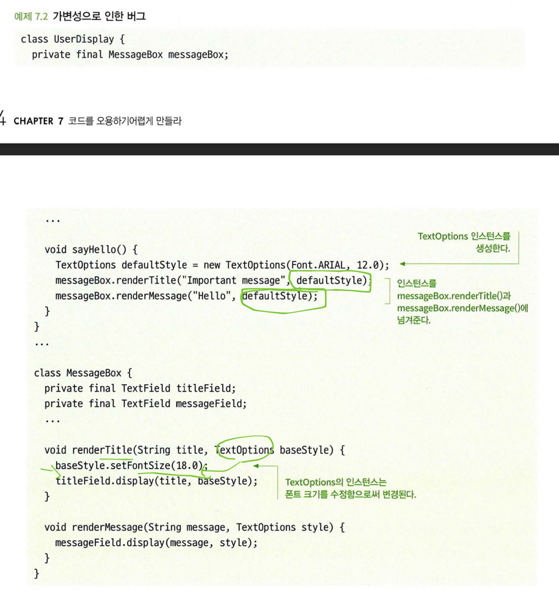
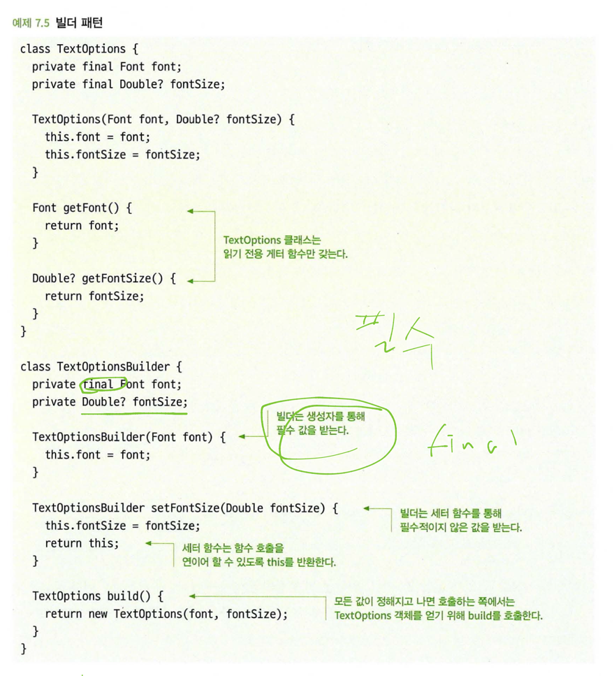
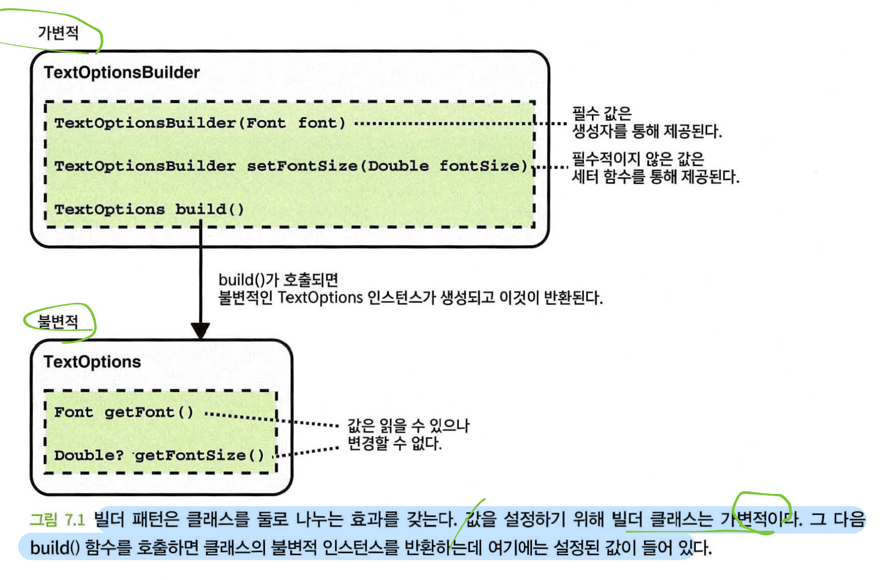
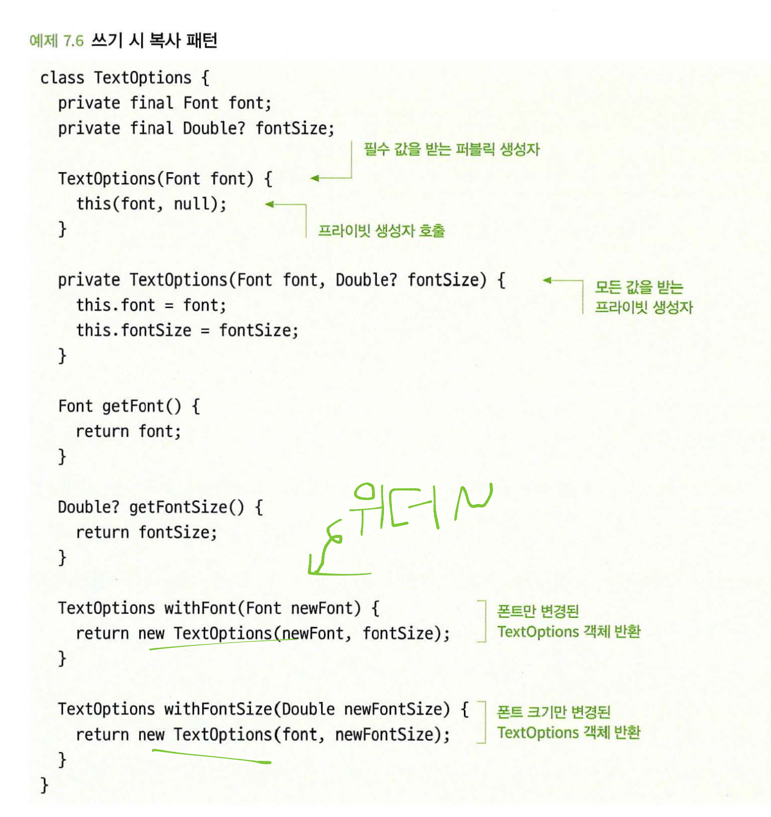
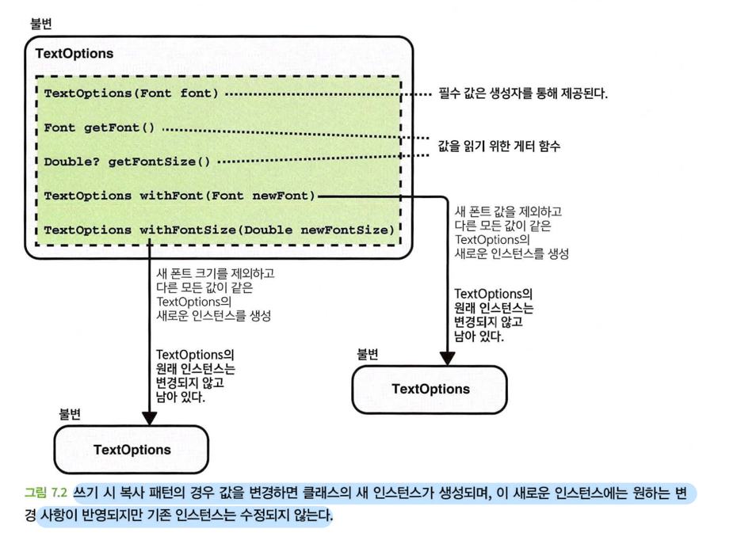
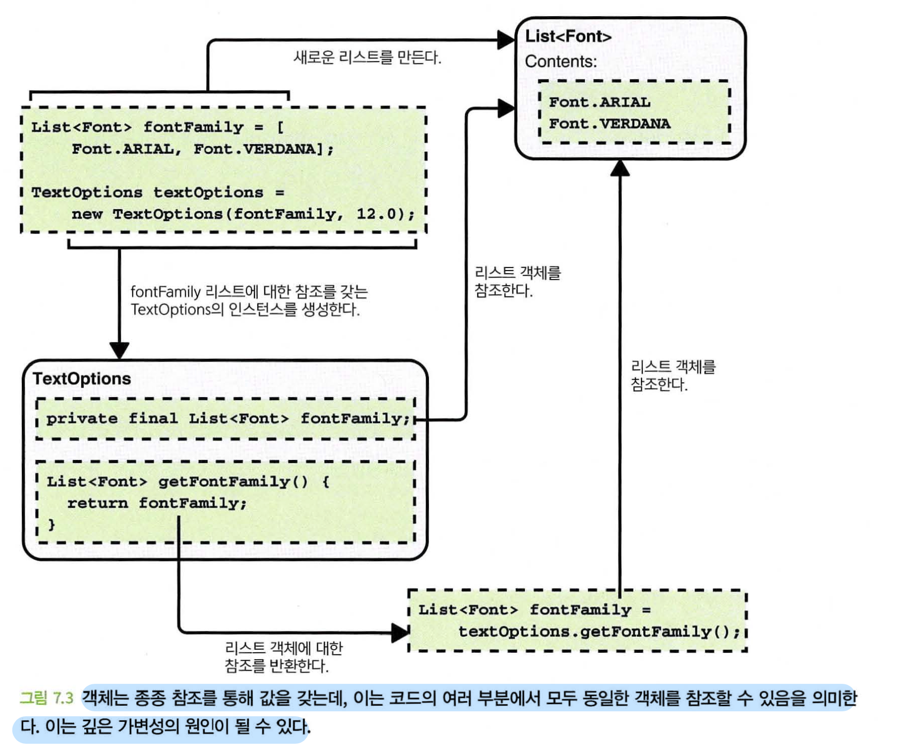
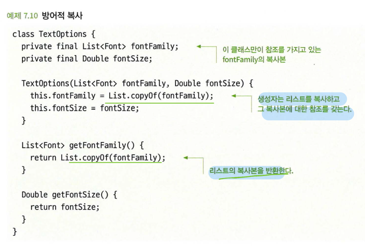
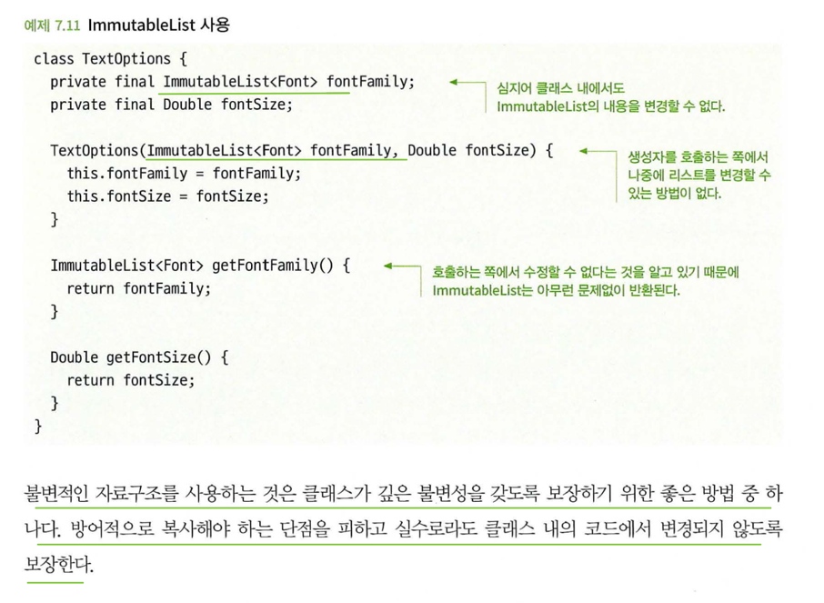
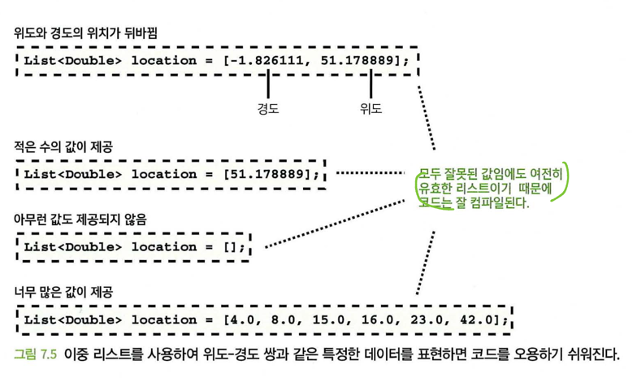
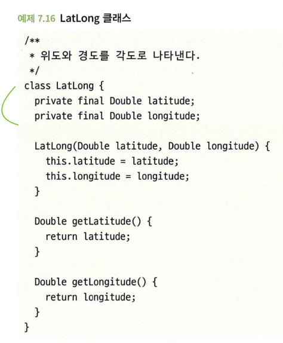

# 7장 코드를 오용하기 어렵게 만들라

 이번 장에서 배우는 것
  - 코드 오남용으로 인해 버그가 발생하는 방식
  - 코드를 오용하기 쉬운 흔한 방식
  - 코드를 오용하기 어렵게 만드는 기술

 비합리적이거나 애매한 가정에 기반해서 코드가 작성되거나 다른 개발자가 잘못된 일을 하는 것을 막지 못할 때 코드는 오용되기 쉽다.
 - 호출하는 쪽에서 잘못된 입력을 제공
 - 다른 코드의 부수 효과 (입력 매개 변수 수정 등)
 - 정확한 시간이나 순서에 따라 함수를 호출하지 않음
 - 관련 코드에서 가정과 맞지 않게 수정이 이루어짐

 오용하기 어려움
  - poka yoke의 lean 제조 개념
    - 소켓과 플러그는 모양이 다르다.
    - 전투기의 탈출 핸들은 다른 항공기 제어장치로부터 멀리 떨어져 있어 우발적으로 작동될 확률을 최소화한다. 

 ## 7.1 불변 객체로 만드는 것을 고려하라
 - 객체가 생성된 후에 상태를 바꿀 수 없다면 이 객체는 불변이다.
 - 가변 객체가 어떤 문제를 일으킬 수 있을까? 
   - 가벽 객체는 추론하기 어렵다.
     - 주스의 경우 변질 방지 봉인이 붙어있으면 안심하고 먹을 수 있지만 그렇지 않으면 독극물을 넣었는지 의심해야한다.
   - 가변 객체는 다중 스레드에서 문제가 발생할 수 있다.

 - 객체를 불변으로 만드는 것은 항상 가능하지도 않고, 또 항상 적절한 것도 아니다.
 - 필연적으로 상태 변화를 추적해야 하는 경우가 있고 이때는 가변적인 자료구조가 필요하다.
 - 하지만 방금 설명했듯이 가변적인 객체는 코드의 복잡성을 늘리고 문제를 일으킬 수 있기 때문에, 기본적으로는 불변적인 객체를 만들되 필요한 곳에서만 가변적이 되도록 하는 것이 바람직하다. 

 ### 7.1.1 가변 클래스는 오용하기 쉽다.
 - 
 - TextOptions 클래스는 가변적이기 때문에 해당 인스턴스를 전달받는 모든 코드는 이 객체를 변경할 수 있고 이로 인해 오용의 위험성이 있다.

 ### 7.1.2 해결책: 객체를 생성할 때만 값을 할당하라
 - 모든 값이 객체의 생성 시에 제공되고 그 이후로는 변경할 수 없도록 함으로써 클래스를 불변적으로 만들 수 있고 오용도 방지할 수 있다.
 - 클래스 내에서 변수를 정의할 때 심지어 클래스 내에서도 변수의 값이 변경되지 않도록 할 수 있다.
 - 해당 변수를 변경하는 코드를 실수로라도 추가하는 것을 방지하고, 그 변수들은 절대 변경되지 않을 것이고 변경되어서도 안된다는 점을 분명하게 한다.
 - 모든 텍스트 옵션값이 반드시 필요한 것이 아니라면 빌더 패턴이나 쓰기 시 복사 패턴을 사용하는 것이 좋다.

 ### 7.1.3 해결책: 불변서에 대한 디자인 패턴을 사용하라
 - 일부값이 반드시 필요하지 않거나 불변적인 클래스의 가변적 버전을 만들어야하는 경우, 클래스를 보다 다용도로 구현해야할 필요가 잇다.
   - 빌더 패턴
   - 쓰기 시 복사 패턴

**빌더 패턴**
 - 클래스를 구성할 수 있는 일부값이 선택 사항인 경우 생성자를 통해 해당 값을 모두 설정하는 것은 상당히 까다로울 수 있다. 이 경우에 세터 함수를 추가하여 클래스를 변경할 수 있도록 만드는 것보다는 빌더 패턴을 사용하는 것이 더 낫다.

**장점**
 - 값을 하나씩 설정할 수 있는 빌더 클래스
 - 빌더에 의해 작성된 불변적인 읽기 전용 클래스

 - 필수 멤버를 설정 함수가 아닌 생성자의 입력 매개변수를 통해 받도록 되어 있다. 따라서 잘못된 객체를 생성하는 코드를 작성할 수 없다. 

**빌더 패턴 구현**
 - 더 나은 네임스페이스를 위해 내부 클래스 사용
 - toBuilder() 함수를 통해 클래스에서 미리 채워진 빌더를 만들 수 있도록 클래스와 클래스 빌더 사이에 순환 의존성 생성
 - 클래스 생성자를 비공개로 만들어 호출하는 쪽에서 빌더를 사용할 수밖에 없도록 함
 - 빌더의 인스턴스를 생성자의 인수로 사용하여 반복적으로 사용되는 코드 감소

**쓰기 시 복사 패턴**

 
 - 클래스를 변경할 수 없게 하는 것은 클래스가 오용될 가능성을 최소화하는 좋은 방법이다.
 - 이것은 세터 함수를 제거하고 인스턴스를 생성할 때에만 값을 제공하면 간단하게 할 수 있다.
 - 다른 상황에서는 그에 맞는 적절한 설계 패턴을 사용해야할 수도 있다.

## 7.2 객체를 깊은 수준까지 불변적으로 만드는 것을 고려하라
 - 클래스가 실수로 가변적으로 될 수 있는 일반적인 경우는 깊은 가변성 때문이다.
 - 멤버 변수 자체가 가변적인 유형이고 다른 코드가 멤버 변수에 액세스할 수 있는 경우에 발생할 수 있다. 

 - 글꼴 목록을 가지고 있는 것이 아니라 글꼴 목록에 대한 참조를 가지고 있다. 
 - 다른 코드에 해당 글꼴 목록에 대한 참조를 가지고 있다면, 글꼴 목록이 변경되면 동일한 리스트를 참조하기 때문에 TextOptions 클래스에도 영향을 미친다.

### 7.2.2 해결책: 방어적으로 복사하라

 - 클래스가 참조하는 객체가 클래스 외부의 코드에서는 참조할 수 없도록 하면 이 문제를 방지할 수 있다.

 - 이것은 클래스가 생성될 때 그리고 게터 함수를 통해 객체가 반환될 때 객체의 복사본을 만들면 가능해진다.
 - 깊은 불변성을 담보하기 위해 효과가 있는 간단한 방법이다. 

- 방어적으로 복사하면 단점이 있다.
  - 복사하는데 비용이 많이 들 수 있다.
  - 클래스 내부에서 발생하는 변경을 막아주지 못한다.

### 7.2.3 해결책: 불변적 자료구조를 사용하라
 - 객체를 불변적으로 만드는 것은 널리 받아들여지고 있는 좋은 관행이다.
 - 장점은 생성되면 아무도 내용을 변경할 수 없다.
 - 어떤 방법은 방어적 복사본을 만들 필요 없이 객체를 전달할 수 있다.
   - Java: Guava 라이브러리의 ImuutableList 

 - 리스트 자체가 불변적이기 대문에 코드의 어디선가 동일한 리스트에 대한 참조가 있는지는 중요하지 않고 어떤 것도 방어적으로 복사할 필요가 없다.

## 7.3 지나치게 일반적인 데이터 유형을 피해라
 - 일반적이고 다재다능하다는 것을 뒤집어 생가해보면 데이터 유형 자체만으로는 무언가를 설명할 수 없고, 가질 수 있는 값에 있어서도 꽤 관대하다는 것을 의미한다.
 - 정수나 리스트와 같은 유형으로 표현이 가능하다고해서 그것이 반드시 좋은 방법은 아니다.
 - 설명이 부족하고 허용하는 범위가 넓을 수록 코드 오용은 쉬워진다.

### 7.3.1 지나치게 일반적인 유형은 오용될 수 있다. 
 - List<List<Double>>과 같은 형태는 아무것도 설명해주지 않는다. (예를 들면 경도와 위도를 가지는 클래스라던지)
 - 형식 안전성이 거의 없다.

 - 다른 개발자가 어떤 작업을 수행하는 데 있어 세부 조항을 의지하는 것은 신뢰할만한 방법이 아닌 경우가 많기 때문에 어느 시점에 함수가 잘못 사용될 수 있고 버그가 발생할 가능성이 크다. 

### 7.3.2 페어 유형은 오용하기 쉽다.
 - 정확히 두 개의 값을 포함해야하므로 호출하는 쪾에서 실수로 너무 적거나 많은 값을 제공하는 것을 방지한다.
 - 그러나 단점이 많다.
   - List<Pari<Double, Double>>가 무슨 의미인지 이해하기 어렵다
   - 개발자는 여전히 위도와 경도의 순서에 대해 혼동하기 쉽다.

### 7.3.3 해결책: 전용 유형 사용
 - 무언가를 나타내기 위해 새로운 클래스를 정의하는 것은 많은 노력이 들거나 불필요한 것처럼 보일 수 있지만, 대부분 보기보다 노력이 덜 들고 다른 개발자가 코드를 읽을 때 이해하기 쉽고 버그의 가능성도 줄여준다. 
 - 예를 들면 위도와 경도를 나타내는 전용 클래스를 정의하는 것이다. 

 - 일반적이고 바로 가져다 쓸 수 있는 데이터 유형을 사용하는 것이 때로는 빠르고 쉬운 방법처럼 보일 수 있지만 무언가 구체적인 것을 나타낼 필요가 있을때 , 전용 유형을 정의하는 것이 더 나을 때가 많다. 코드가 훨씬 더 명확해지고 오용하기 어렵기 때문에 중장기적으로 보자면 시간이 절약된다.